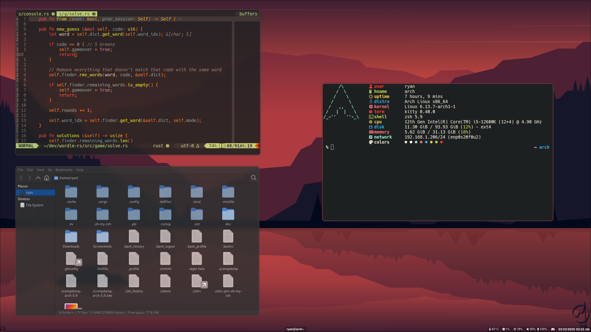

# ~/.dotfiles
A constant work in progress.

Currently working on my Arch Linux + Hyprland setup, but there's stuff for 
Windows in here too. I plan to start using Linux more often but for now I'm
stuck on Windows for schoolwork.

! This is not meant to be a template - the source files are not 
well structured / commented / attributed !



## Setup (Arch)

- Ensure Arch / Hyprland are setup properly on the system
  - (This doesn't install things like sddm)
- Install packages
  ```
  sudo pacman -S --needed --noconfirm $(< pkgs.txt)
  ```
- Install `oh-my-zsh`
  ```
  sh -c "$(curl -fsSL https://raw.githubusercontent.com/ohmyzsh/ohmyzsh/master/tools/install.sh)"
  ```
- Clone repo and run `stow` (creates a bunch of symlinks)
  ```
  cd ~
  git clone git@github.com:rpeabody43/dotfiles.git .dotfiles
  cd .dotfiles
  stow .
  ```
- To delete symlinks, run
  ```
  stow -D .
  ```

## Setup (Windows)

- use [winstow](https://github.com/rpeabody43/winstow) to automatically create symlinks based on `winstow.toml`
  ```
  winstow
  ```

## Hyprland Binds Reference
| Bind | Function |
|--|--|
| Alt + Enter | Terminal (kitty) |
| Ctrl + Enter | Terminal in same dir|
| Alt + Ctrl + Enter | Launcher (wofi) |
| Alt + E | File Explorer (thunar) |
| Alt + Backspace | Exit program |
| Alt + F | Toggle floating |
| Alt + P | Toggle pseudo |
| Alt + T | Toggle split direction |
| Ctrl + Alt + Del | Exit Hyprland |
| Alt + [1-9] | Switch workspace |
| Alt + Shift + [1-9] | Move app to workspace |
| Alt + Mouse1 | Move window |
| Alt + Mouse2 | Resize window |

## TODO
- Make a proper install script
  - Currently all packages are meant to be installed with pacman 
    (except oh-my-zsh), but adding AUR could make this ugly
- Properly theme with gtk, etc.
  - wofi looks very ugly at the moment
- Get more apps working on linux
  - Spotify, Notion, etc.
- Maybe include programming specific stuff?
  - Install rust, go, etc. so I don't have to do it every time
